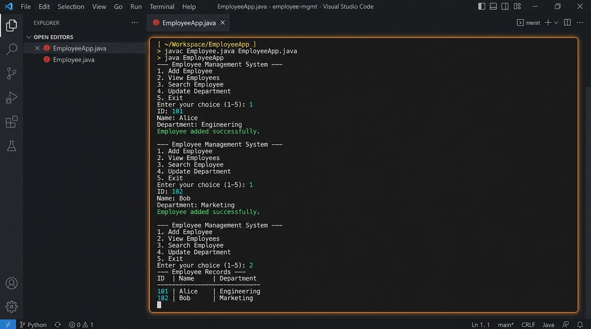
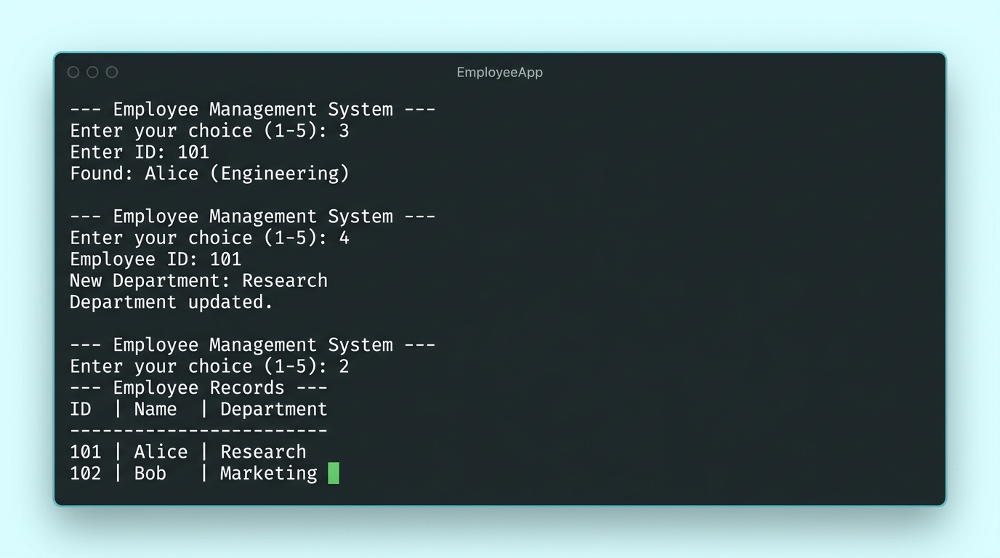

# Core Java - Employee Management System

A clean, robust, and interactive console-based Employee Management System (EMS) built with Core Java. This project demonstrates foundational Java programming concepts, object-oriented design, dynamic data structures, and scanner-based command-line user interfaces.

This is Task 1 of the Java Developer Internship.

---

## 🚀 Features

The application supports standard CRUD (Create, Read, Update) operations for employee records:
1. **Add Employee**: Create new employee records with validation (ensures ID is a positive integer and is unique).
2. **View Employees**: Display all registered employees in a formatted table.
3. **Search Employee**: Look up an employee by their unique ID.
4. **Update Department**: Modify the department of an existing employee.
5. **Exit**: Gracefully close the application.

---

## 🛠️ Concepts Covered

This project covers core Java programming fundamentals:
* **Classes & Objects**: Defining an `Employee` class as a data model containing attributes (`id`, `name`, `department`).
* **Constructors**: Parameterized constructor to initialize the employee attributes.
* **Java Collections Framework**: Utilizing `ArrayList<Employee>` for dynamic data storage to avoid fixed-size array constraints.
* **Console Input & Validation**: Processing console inputs with `java.util.Scanner` and implementing exception handling using `InputMismatchException` to prevent application crashes from invalid inputs.
* **Control Flow & Switches**: Managing the continuous application loop using a `while(true)` loop and the modern Java arrow-based switch expressions (`switch (choice) ->`).

---

## 📁 Project Structure

The project consists of two key Java source files:

1. **[Employee.java](file:///C:/Users/sonag/EmployeeManagementSystem/Employee.java)**: Represents the employee entity (Data Model).
2. **[EmployeeApp.java](file:///C:/Users/sonag/EmployeeManagementSystem/EmployeeApp.java)**: Implements the system controller, CRUD methods, and user interaction menu.

Additionally, output screenshots are provided in the directory:
* **`screenshot_add_view.jpg`**: Screenshot showing adding and viewing employees.
* **`screenshot_search_update.jpg`**: Screenshot showing searching and updating an employee's department.

---

## 💻 How to Compile and Run

Make sure you have Java Development Kit (JDK) 8 or later installed on your system. This project was developed and verified on **Java JDK 22**.

### Compilation
Open your terminal/command prompt in the project directory and run the following command to compile all Java source files:
```bash
javac Employee.java EmployeeApp.java
```

### Execution
Run the compiled application using:
```bash
java EmployeeApp
```

For convenience, you can also double-click/run the provided runner script if on Windows:
* **`run.bat`**

### Automated Verification
To run the application with a pre-configured sequence of operations (adding, viewing, searching, updating, and exiting):
```bash
# On Windows Command Prompt:
java EmployeeApp < test_input.txt

# On PowerShell:
Get-Content test_input.txt | java EmployeeApp
```


---

## 🔄 Program Flow & Screenshots

### 1. Adding and Viewing Employees
When you launch the app, you will be presented with a menu. You can add new employee records and list them:



### 2. Searching and Updating Employee Records
You can quickly look up an employee by their ID and modify their department. Changes are immediately reflected in the system:



---

## 🧪 Error Handling & Enhancements Included
Compared to simple template code, this project includes several real-world developer refinements:
* **Unique ID Check**: The system prevents duplicate IDs from being registered.
* **Crash-Resistant Inputs**: If a user enters non-integer values for IDs or menu choices, the application handles `InputMismatchException` gracefully without crashing, clears the scanner buffer, and prompts the user again.
* **Empty List Handling**: Prints a user-friendly message when attempting to view employees while the registry is empty.
